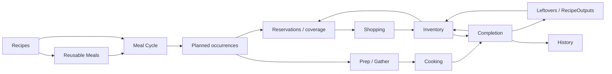

# Core Concepts

HomeMaker connects meal planning with the operational work needed to execute that plan: inventory, shopping, prep, cooking, completion, leftovers, and history.

Understanding the following concepts makes the rest of the application easier to reason about.

## Ingredient

An Ingredient is the canonical food identity used across recipes, inventory, shopping, reservations, and completion.

Ingredient aliases allow alternative names to resolve back to the same canonical Ingredient.

## Recipe

A Recipe defines how to produce food.

A Recipe can contain:

- ingredients
- preparation groups
- advance-prep instructions
- cooking steps
- equipment
- substitutions
- variants
- reusable RecipeOutputs

Recipe quantities are scalable.

## RecipeOutput

A RecipeOutput is a reusable output produced by a Recipe.

Examples conceptually include a sauce, stock, cooked component, or other prepared item intended to be used later.

Produced RecipeOutputs can enter inventory and satisfy later planned demand.

## Meal

A Meal is a reusable composition of one or more Recipes.

It is a planning template, not a specific scheduled occurrence.

## Meal Cycle

A Meal Cycle is the main planning/execution container.

It defines:

- how many days are in the cycle,
- which meal slots exist,
- optional serving times,
- scheduled occurrences,
- planning preferences/rules, and
- lifecycle state.

Current lifecycle states are:

```text
DRAFT
ACTIVE
COMPLETED
CANCELLED
```

### Draft

A `DRAFT` cycle can be scheduled and edited before execution begins.

### Active

An `ACTIVE` cycle participates in operational reconciliation: reservations, shopping demand, prep, gather, produced-stock coverage, and other derived views are kept aligned with the current plan.

Only one cycle can be active for the household at a time.

### Completed

A `COMPLETED` cycle represents finished execution.

Completion requires its planned meal occurrences to have finalized completion records.

### Cancelled

A cancelled cycle no longer drives active reservations/coverage.

## Slot definition and CycleSlot

A slot definition describes a recurring position such as a named meal period and optional serving time.

A CycleSlot is one concrete day/slot combination inside a Meal Cycle.

## PlannedMeal

A PlannedMeal is a concrete scheduled occurrence.

It is different from a reusable Meal:

- **Meal** — reusable template
- **PlannedMeal** — one occurrence at a specific CycleSlot

Planned occurrences store snapshots of relevant source data so later edits to reusable Recipes/Meals do not silently rewrite the historical/planned occurrence.

The implementation supports saved Meals and direct Recipes as food-producing occurrence sources and also contains occurrence support for leftovers, RecipeOutputs, and non-food/manual outcomes in the broader cycle workflow.

## InventoryLot

An InventoryLot represents a physical quantity in stock.

A lot can represent:

- an Ingredient,
- a Leftover, or
- a RecipeOutput.

Lots carry quantity/unit and storage/date metadata.

## Inventory reservation

A reservation represents future planned demand against inventory.

A reservation does not consume inventory. It reduces what is considered available for other future demand.

Actual consumption is recorded during completion/allocation workflows.

## Shopping list

A generated ShoppingList represents Ingredient demand for a Meal Cycle after considering available inventory and other planning effects.

Generated shopping demand can evolve when an active plan changes.

Purchase history is persisted separately so regeneration can preserve completed/partial/substitution purchase records.

## Manual shopping item

A manual shopping item is intentionally separate from generated cycle demand.

It can be used for household purchases that are not created by Meal Cycle requirement calculations.

A manual purchase creates inventory only when it is explicitly tied to an Ingredient and includes the required intake information.

## Gather

Gather workflows identify stock that should be collected from storage locations for upcoming use.

Gather selections are operational state derived from the current plan/inventory picture.

## Prep

Prep workflows surface work that should happen before serving/cooking time.

Prep reminder delivery state is persisted so reminders can avoid repeated delivery and remain visible when browser notifications are unavailable or denied.

## MealCompletion

MealCompletion records what actually happened for a PlannedMeal.

It progresses from:

```text
DRAFT
FINALIZED
```

Completion captures actual produced/eaten servings and ingredient usage.

Finalized occurrence records are treated as immutable history.

## Completion usage and allocation

Completion usage describes planned versus actual Ingredient use.

Allocations connect actual usage to concrete InventoryLots and inventory transactions.

This is what turns planned consumption into traceable inventory history.

## Leftover

A Leftover is produced food retained after a completed occurrence.

It can become inventory and later serve as a source for another planned occurrence or demand-coverage workflow.

## History

History is based on finalized persisted completion/reconciliation data rather than a reconstructed view of the current Recipe/Meal definitions.

That distinction is important: historical records should continue to describe what was planned/used at the time even when reusable definitions change later.

## End-to-end flow



## Planning versus actuals

A core design principle is separation between intended state and actual execution:

| Planning | Actual execution |
| --- | --- |
| PlannedMeal | MealCompletion |
| scaled/snapshot component quantities | actual usage |
| reservation | inventory transaction/allocation |
| shopping requirement | concrete purchase |
| planned leftover servings | produced Leftover/RecipeOutput |

Keeping these separate allows the application to reconcile real-world deviations without rewriting the original plan.
