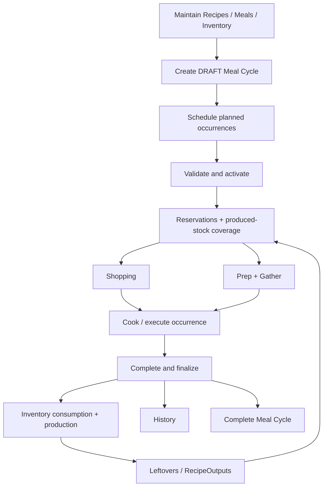

# Workflow Guide

HomeMaker is organized around an execution cycle rather than a standalone calendar. Planning affects inventory reservations, shopping, prep, gather, cooking, completion, leftovers, and history.

This guide explains the implemented workflow at a behavioral level. UI labels may evolve; the persisted lifecycle and backend rules are the authoritative contract.

## End-to-end workflow



## 1. Maintain reusable food definitions

Before planning, the application can maintain canonical Ingredients, Recipes, RecipeOutputs, reusable Meals, equipment/reference data, and physical inventory.

A Recipe is a food-production definition.

A Meal is a reusable composition of Recipes.

Neither is a scheduled occurrence until placed into a Meal Cycle.

## 2. Create a Meal Cycle

A new Meal Cycle begins in `DRAFT`.

A cycle defines:

- duration
- recurring slot definitions
- serving times
- start date
- planning/population rules
- smart-planning preferences

Concrete CycleSlots are generated from the cycle days and slot definitions.

### Draft behavior

While `DRAFT`, the cycle can be edited freely through the supported planning routes.

The cycle does not become the active operational plan until activation succeeds.

## 3. Schedule occurrences

Each concrete CycleSlot can hold a PlannedMeal/occurrence.

Implemented occurrence sources include:

- saved Meal
- direct Recipe
- Leftover
- RecipeOutput
- Manual entry
- Eating Out
- Skipped

### Food-producing occurrences

Saved Meals and direct Recipes participate in the normal food workflow and can contribute ingredient demand, shopping, prep, gather, cooking, inventory use, and completion.

### Non-food occurrences

Manual entries, Eating Out, and Skipped occurrences are historical/planning entries rather than ingredient-producing requirements.

They do not create Ingredient reservations, Shopping demand, prep, Gather, Cooking, or Inventory deductions.

### Snapshots

Food occurrences persist source/snapshot information when planned.

This prevents later edits to reusable Meal/Recipe definitions from silently rewriting an existing occurrence.

## 4. Validate and activate the cycle

Activation transitions:

```text
DRAFT -> ACTIVE
```

Activation requires:

- a start date,
- serving times for slot definitions,
- no other active cycle for the household, and
- no blocking cycle-validation errors.

Only one Meal Cycle can be active at a time.

Activation is the boundary where the plan becomes operational.

## 5. Reservations and produced-stock coverage

Once active, future ingredient demand is represented through reservations and production coverage.

### Inventory reservation

A reservation represents planned future use of existing inventory.

It does not reduce the physical lot quantity.

### Produced-stock coverage

Future Leftover/RecipeOutput production can cover later demand.

Coverage is tracked separately so the planner can account for food expected to exist later without pretending it already exists physically.

## 6. Shopping

Shopping demand is derived from the active plan, current inventory, reservations/coverage, and existing purchase state.

Generated shopping items track planned requirement rather than being an isolated checklist.

### Partial purchases

One generated requirement can have multiple purchase records.

A partial purchase records what was actually bought without falsely marking the whole original requirement as purchased.

### Substitutions

A purchase can record:

- the Ingredient actually bought, and
- the amount of the original requirement that purchase satisfies.

This keeps shopping history and inventory intake distinct from the original demand identity.

### Regeneration

When the active plan changes, shopping demand can be regenerated/reconciled.

Completed purchase history is preserved.

The application can surface:

- newly added demand,
- removed demand, and
- purchased excess created by later plan changes.

## 7. Manual shopping

Manual shopping items are separate from generated Meal Cycle demand.

They can be:

- added
- edited
- removed
- completed
- skipped

Shopping regeneration preserves them.

Completing a manual shopping item creates inventory only when the item is explicitly linked to an Ingredient and the required intake information is supplied.

## 8. Change an active plan

Unfinalized occurrences in an `ACTIVE` cycle can be revised through supported workflows.

Examples include:

- add
- replace
- move
- remove
- change serving quantity

These edits are not simple calendar mutations. The backend reconciles dependent operational state in the same transaction.

Affected derived state can include:

- Ingredient reservations
- produced-stock coverage
- Gather selections
- Shopping demand
- validation
- prep
- other operational views

Finalized occurrences cannot be rewritten by active-cycle editing.

## 9. Prep and reminders

Prep workflows represent work required before a serving/cooking time.

Prep reminders have persisted delivery/acknowledgement state.

When browser/Windows notification permission is granted, reminders are delivered once through the supported notification mechanism.

When browser notifications are unavailable or denied, due/overdue reminders remain visible in the Dashboard rather than disappearing from the workflow.

## 10. Gather

Gather is the bridge between abstract inventory and the physical act of collecting required stock from storage locations.

Gather selections are derived operational state and can change when the active plan or inventory picture changes.

## 11. Cooking

Food-producing planned occurrences can enter the cooking workflow.

Recipes can provide cooking-step, timer, equipment, temperature, coordination, dependency, and preparation metadata.

Cooking support is tied to the planned occurrence; non-food occurrences do not enter this workflow.

## 12. Complete an occurrence

Meal completion records what actually happened rather than overwriting what was planned.

A MealCompletion progresses from:

```text
DRAFT -> FINALIZED
```

It captures information such as:

- actual servings produced/eaten
- actual ingredient use
- inventory allocations
- inventory transactions
- produced leftovers/RecipeOutputs

When switching between PlannedMeals in the completion screen, HomeMaker keeps each in-flight action associated with the PlannedMeal that initiated it. A delayed response from a previously selected Meal is ignored rather than being displayed under the newly selected Meal.

### Planned versus actual

The application keeps both sides:

| Planned | Actual |
| --- | --- |
| planned servings | produced/eaten servings |
| planned component usage | completion usage |
| reservation | allocation/consumption transaction |
| planned leftover quantity | produced Leftover/RecipeOutput |

That separation allows real execution to differ from the plan without destroying planning history.

## 13. Inventory reconciliation

Actual consumption is connected to concrete InventoryLots through completion allocations and InventoryTransactions.

Reservations are future intent; allocations/transactions are actual stock changes.

Produced Leftovers/RecipeOutputs can become new InventoryLots and participate in later planning.

## 14. History

Finalized occurrences are immutable.

History exposes persisted reconciliation snapshots rather than recalculating the past from current Recipe/Meal definitions.

Historical information includes finalized Meal data, actual usage/allocation provenance, and produced leftovers/RecipeOutputs.

Inventory transaction history provides lot-level provenance for stock changes.

## 15. Complete or cancel the Meal Cycle

### Complete

An `ACTIVE` cycle can transition to `COMPLETED` only when all PlannedMeals requiring completion have finalized completion records.

Completing the cycle releases remaining active inventory and production-coverage reservations.

### Cancel

A non-completed cycle can transition to `CANCELLED`.

Cancellation releases active reservations/coverage.

A completed cycle cannot be cancelled through the normal lifecycle route.

## Common workflow rules

- Do not manually edit SQLite to bypass lifecycle validation.
- Do not treat a reservation as physical consumption.
- Do not treat a generated ShoppingListItem as purchase history.
- Do not rewrite finalized occurrences.
- Do not expect non-food occurrences to generate food demand.
- Expect active-cycle edits to change derived operational views.
- Treat reusable Recipes/Meals and scheduled occurrence snapshots as different layers.
